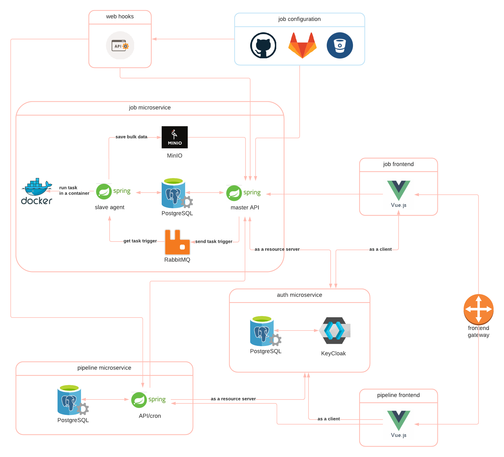

# Contributing

## Architecture

### Components



([View in LucidChart](https://lucid.app/lucidchart/invitations/accept/cfa80c68-9da6-412b-8d77-1e36d3d5fd47))

## Local development environments

### `dev`

* Java, maven, STS, and docker are installed in the local machine.
* Persistent storages are through `docker-compose.dev.yml`.

In each microservice folder

```bash
docker-compose -f docker-compose.dev.yml rm -v -f job-postgres # job microservice
docker-compose -f docker-compose.dev.yml up
```

Tests:

* From STS: No special setup needed.
* From command line: `mvn verify`

Run server:

* From STS: Need to setup environment variable `SPRING_PROFILES_ACTIVE=dev` in "Run configurations" of `*Application.java`. Then the service should be available from `localhost:8080`.

### `docker`

```bash
cd job-microservice
bash docker_build-mac.sh
docker-compose up
```

Then you can access job microservice API by `localhost:8881`.

```bash
cd pipeline-microservice
bash docker_build-mac.sh
docker-compose up
```

Then you can access pipeline microservice API by `localhost:8882` (with mocked job microservice).

## Deployment

### GKE/Skaffold

```bash
gcloud container clusters create restfulci --num-nodes=6
gcloud container clusters get-credentials restfulci

gcloud container clusters delete restfulci
```

```bash
skaffold run
skaffold delete
```

```bash
kubectl create -f kubernetes --save-config
kubectl apply -f kubernetes

kubectl delete --all pods --namespace=default
kubectl delete --all deployments --namespace=default
kubectl delete --all services --namespace=default
kubectl delete --all configmaps --namespace=default
kubectl delete --all persistentvolumeclaims --namespace=default
```
